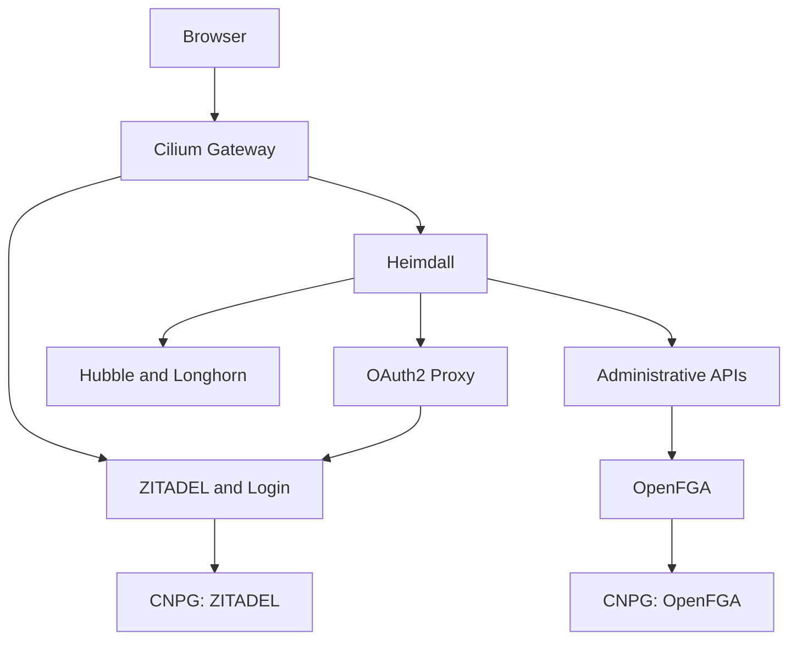

# Design and upstream integrations

The deployed request path is:

The four roles are explicit: ZITADEL issues identities; OAuth2 Proxy implements
the browser authorization-code flow and session cookies; Heimdall verifies the
session and routes authenticated traffic; OpenFGA provides the future
authorization decision service. It currently has **no store, model or tuples**,
and Heimdall makes no OpenFGA Check call yet.

Administrative browser access currently uses one coarse, explicit allowlist.
There are no per-resource permissions, delegated grants, actor unions or copied
application roles in ZITADEL. The next authorization step can replace that gate
with OpenFGA checks while preserving stable ZITADEL subject IDs. Do not treat
authentication alone as permission to use an administrative application.

ZITADEL supports humans and service accounts. This repository bootstraps a human
administrator and deployment-only machine credentials. It does not issue
privileged credentials for autonomous agents or invent a delegation broker.
Agent registration, accepted API token audiences, actor/subject validation and
the resource/permission model belong to the next step. Until then, service-account
or exchanged tokens do not bypass the browser gate.

ZITADEL's own native console authorization remains in ZITADEL. Protocol checks,
session validation, CSRF/Origin checks and service network boundaries remain in
their appropriate protocol/enforcement components. OpenFGA models will not be
used as a replacement for authenticating a token or validating its issuer.

No new gateway, ingress controller, database operator, secret controller, Redis,
custom identity service or custom authorization adapter is deployed. Bootstrap
uses the official ZITADEL Terraform provider through OpenTofu and ordinary
Kubernetes Secret provisioning. The shell/Python files are deployment and
validation tooling, not services in the authentication request path.

The integration sources used for implementation:

- [ZITADEL Helm chart and tested examples](https://github.com/zitadel/zitadel-charts/tree/main/charts/zitadel)
- [ZITADEL integration with OAuth2 Proxy](https://zitadel.com/docs/examples/identity-proxy/oauth2-proxy)
- [Heimdall first-party OIDC integration](https://github.com/dadrus/heimdall/blob/v0.17.22/docs/content/guides/authn/oidc_first_party_auth.adoc)
- [Heimdall OpenFGA integration for the next step](https://github.com/dadrus/heimdall/blob/v0.17.22/docs/content/guides/authz/openfga.adoc)
- [Official ZITADEL Terraform provider](https://github.com/zitadel/terraform-provider-zitadel)
- [OpenFGA official chart](https://github.com/openfga/helm-charts/tree/openfga-0.3.14/charts/openfga)
- [Base networking and Gateway configuration](https://github.com/Sebastian-Nowaczyk-Elektrorecykling/minimum-k8s-net-elektro)

Compatibility was inspected against network commit
`c7fba1d6df4c9dbc84ee29be8d197df57786b971` and storage commit
`f11ddf0910058ff7c336e52fabb18ea9e838d988`. The base repository owns Cilium,
Hubble's UI and Service, and the shared Gateway. This repository owns the
SSO-protected administration HTTPRoute, including `hubble.admin.internal`, in
`authn-admin`. It forwards to the same-namespace Heimdall Service; Heimdall
reaches the existing Hubble Service over the cluster network. The ingress guard
allows only Heimdall pods to reach Hubble UI.
